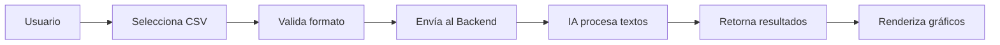

# 🖥️ SentimentAPI - Frontend de Análisis de Sentimientos

<div align="center">


**Análisis de sentimientos con IA • Multilingüe: Español & Português**

[Demo](#-demo) • [Características](#-características) • [Instalación](#-instalación) • [Uso](#-uso)

</div>

---

## 📋 Descripción del Proyecto

**SentimentAPI** es una aplicación web moderna diseñada para analizar sentimientos en textos utilizando inteligencia artificial avanzada. Permite a los usuarios procesar feedback, comentarios y reseñas en español y portugués, obteniendo insights valiosos mediante visualizaciones interactivas y estadísticas detalladas.

### 🎯 Propósito

Esta interfaz frontend se conecta con La API llamada **SentimentAPI** para ofrecer:
- ✅ **Análisis instantáneo** de textos individuales o masivos
- 📊 **Visualizaciones interactivas** con gráficos y estadísticas
- 🔐 **Gestión de usuarios** con autenticación JWT
- 📁 **Historial de análisis** para usuarios registrados
- 🏷️ **Análisis por productos** organizados por categorías
- 💾 **Carga de archivos CSV** para procesamiento batch

---

## ✨ Características

### 🚀 Funcionalidades Principales

| Característica | Descripción |
|---------------|-------------|
| **Análisis Simple** | Procesa un texto individual y obtén el sentimiento (Positivo/Negativo/Neutral) |
| **Análisis Múltiple** | Procesa múltiples textos simultáneamente con estadísticas agregadas |
| **Carga CSV** | Sube archivos CSV con columna "texto" para análisis masivo |
| **Análisis por Productos** | Asocia comentarios a productos específicos por categoría |
| **Historial** | Visualiza análisis previos con gráficos de tendencias |
| **Modo Demo** | Prueba la plataforma sin registro |

### 🎨 Experiencia de Usuario

- **Interfaz Moderna**: Diseño con gradientes, glassmorphism y animaciones fluidas
- **Responsive**: Optimizado para desktop, tablet y móvil
- **Feedback Visual**: Indicadores de carga, mensajes de éxito/error claros
- **Navegación Intuitiva**: Flujo guiado paso a paso para análisis complejos

---

## 🏗️ Arquitectura

```
┌─────────────────────────────────────────────────────────────────┐
│                     React Frontend App                          │
├─────────────────────────────────────────────────────────────────┤
│                                                                 │
│  ┌──────────────────────┐         ┌─────────────────────────┐  │
│  │   🎨 UI Layer        │         │  ⚙️ Logic Layer         │  │
│  │   (Tailwind CSS)     │         │  (Services & Hooks)     │  │
│  │                      │         │                         │  │
│  │  • Landing           │  ────►  │  • authService.js       │  │
│  │  • DashboardView     │  ◄────  │  • sentimentService.js  │  │
│  │  • AnalysisView      │         │  • api.js (Axios)       │  │
│  │  • HistoryView       │         │                         │  │
│  │                      │         │                         │  │
│  └──────────────────────┘         └─────────────────────────┘  │
│                                                                 │
└─────────────────────────────────────────────────────────────────┘
                              ↕
                    🌐 SentimentAPI Backend
                 (http://localhost:8080/api/v2)
```

### 📂 Estructura del Proyecto

```
src/
├── components/
│   └── layout/
│       └── Navbar.jsx          # Navegación principal
├── config/
│   └── api.js                  # Configuración de endpoints
├── services/
│   ├── authService.js          # Login y Registro
│   └── sentimentService.js     # Análisis de sentimientos
├── utils/
│   ├── formatName.js           # Formateo de nombres
│   └── sentiment.js            # Helpers de sentimientos
├── views/
│   ├── Landing.jsx             # Página de inicio
│   ├── Auth.jsx                # Login/Registro
│   ├── DashboardView.jsx       # Panel principal
│   ├── AnalysisView.jsx        # Análisis (simple/batch)
│   ├── HistoryView.jsx         # Historial con gráficos
│   ├── CategorySelectionView.jsx
│   ├── ProductSelectionView.jsx
│   └── DemoSelectionView.jsx
├── App.jsx                     # Router principal
└── main.jsx                    # Punto de entrada
```

---

## 🛠️ Tecnologías Utilizadas

### Core Stack

| Tecnología | Versión | Propósito |
|-----------|---------|-----------|
| **React** | 19.2.0 | Framework principal |
| **Vite** | 7.2.4 | Build tool y dev server |
| **Tailwind CSS** | 4.1.18 | Estilos y diseño |
| **React Router DOM** | 7.12.0 | Navegación SPA |

### Librerías Adicionales

- **Lucide React** (0.562.0): Iconografía moderna
- **Recharts** (2.15.0): Gráficos interactivos
- **ESLint** (9.39.1): Linting y calidad de código

---

## 🚀 Instalación

### Prerrequisitos

- **Node.js** >= 20.19.0
- **npm** >= 8.0.0
- Backend **SentimentAPI** corriendo en `http://localhost:8080`

### Pasos de Instalación

1. **Clonar el repositorio**
```bash
git clone https://github.com/tu-usuario/sentimentapi-frontend.git
cd sentimentapi-frontend
```

2. **Instalar dependencias**
```bash
npm install
```

3. **Configurar variables de entorno** (opcional)

Edita `src/config/api.js` para ajustar la URL del backend:

```javascript
const API_BASE_URL = 'http://localhost:8080/project/api/v2';
```

4. **Iniciar servidor de desarrollo**
```bash
npm run dev
```

5. **Abrir en el navegador**
```
http://localhost:5173
```

---

## 💻 Uso

### 🎭 Modo Demo

1. Haz clic en **"Ver Demo"** en la página de inicio
2. Elige entre **Análisis Simple** o **Análisis Múltiple**
3. Ingresa tus textos y analiza sin necesidad de registro

### 👤 Usuarios Registrados

#### Registro
1. Clic en **"Registrarse"**
2. Completa: Nombre, Apellido, Email, Contraseña
3. Serás redirigido al login automáticamente

#### Login
1. Ingresa tu email y contraseña
2. Accede al **Dashboard** completo

#### Dashboard
- **Análisis Simple**: Procesa un texto individual
- **Análisis Múltiple**: Procesa varios textos o carga CSV
- **Historial**: Revisa análisis anteriores con gráficos

### 📊 Análisis Múltiple con Productos

1. Selecciona **"Análisis Múltiple"**
2. **Paso 1**: Elige una categoría (ej. "Electrónica")
3. **Paso 2**: Selecciona productos o crea nuevos
4. **Paso 3**: Ingresa textos o carga CSV
5. Visualiza resultados con desglose por producto

### 📁 Carga de CSV

Tu archivo debe tener esta estructura:

```csv
texto
"Este producto es excelente"
"No me gustó la calidad"
"Es bueno pero caro"
```

**Límites**: Hasta 500 filas por archivo

---

## 🔄 Flujo de Análisis Batch



**Procesamiento**:
1. El frontend valida la columna "texto"
2. Envía datos al endpoint `/sentiment/analyze/batch`
3. El backend usa modelos de ML (Python)
4. Retorna JSON con sentimientos + probabilidades
5. Frontend calcula estadísticas y renderiza UI

---

## 🎨 Ejemplos Visuales

### Dashboard Principal
```
┌────────────────────────────────────────────┐
│  🏠 Dashboard                              │
├────────────────────────────────────────────┤
│                                            │
│  Hola Juan!                                │
│  ¿Qué deseas hacer hoy?                    │
│                                            │
│  [📄 Análisis Simple] [📊 Análisis Múltiple]│
│  [📜 Ver Historial]                        │
└────────────────────────────────────────────┘
```

### Resultados de Análisis
```
┌────────────────────────────────────────────┐
│  📈 Análisis Completado                    │
├────────────────────────────────────────────┤
│  Textos Analizados: 125                    │
│                                            │
│  ✅ Positivos: 87 (69.6%)                  │
│  ⚠️  Neutrales: 25 (20.0%)                 │
│  ❌ Negativos: 13 (10.4%)                  │
│                                            │
│  [Ver desglose por producto]               │
└────────────────────────────────────────────┘
```

---

## 🔐 Seguridad

- **JWT Authentication**: Tokens seguros para sesiones
- **LocalStorage**: Persistencia local de sesión
- **Protected Routes**: Rutas protegidas con React Router
- **CORS**: Configurado en el backend

---

## 📦 Scripts Disponibles

```bash
# Desarrollo
npm run dev          # Inicia servidor de desarrollo (puerto 5173)

# Producción
npm run build        # Genera build optimizado en /dist
npm run preview      # Previsualiza build de producción

# Calidad de Código
npm run lint         # Ejecuta ESLint
```

---

## 🚧 Próximos Pasos

- [ ] Implementar previsualización de CSV antes de analizar
- [ ] Agregar gráficos dinámicos por producto (Recharts)
- [ ] Exportar resultados a PDF/Excel
- [ ] Modo oscuro/claro configurable
- [ ] Soporte para más idiomas (Inglés, Francés)
- [ ] PWA (Progressive Web App) para uso offline

---

## 🤝 Contribuciones

Este proyecto fue desarrollado como parte de la **Hackatón ONE H12-25-L** por el equipo:

### 👥 Equipo "No Data - No Code"

| Rol | Nombre |
|-----|--------|
| **Frontend Lead** | [Tu Nombre] |
| **Backend Lead** | [Nombre del compañero] |
| **ML Engineer** | [Nombre del compañero] |
| **UX/UI Designer** | [Nombre del compañero] |

---

## 📄 Licencia

Este proyecto es parte de un trabajo académico de la Hackatón ONE 2026.

---

## 🙏 Agradecimientos

- **Oracle Next Education (ONE)** por la oportunidad
- **Alura Latam** por el soporte educativo
- Comunidad de **React** y **Tailwind CSS**
- Todos los que probaron y dieron feedback al proyecto

---

<div align="center">

### 🌟 ¡Gracias por usar SentimentAPI!

**Desarrollado con ❤️ por el equipo No Data - No Code**

[](https://github.com/tu-usuario/sentimentapi-frontend)
[](https://tu-demo-url.com)

</div>

---
**¡Feliz análisis de sentimientos! 🚀**
